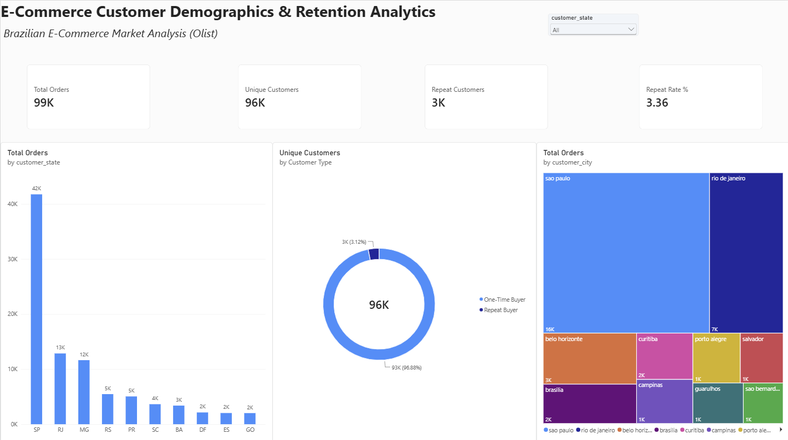

# 📊 Brazilian E-Commerce: Customer Demographics & Retention Analytics

An end-to-end data analytics project evaluating customer acquisition patterns, geographic demand concentration, and repeat purchase retention across 99,440+ Brazilian e-commerce orders (Olist dataset).

---

## Executive Dashboard Preview


---

## Tech Stack & Workflow
- **Data Wrangling & EDA:** Python (Pandas)
- **Database & Querying:** MySQL Workbench (CTEs, Window Functions, DENSE_RANK, Aggregate Functions)
- **Business Intelligence & Reporting:** Power BI Desktop (DAX Measures, Calculated Columns, Dropdown Slicers)

---

## Key Business Insights
1. **Extreme Geographic Concentration (Pareto Principle):**
   - **São Paulo (SP)** generates **41.98% (41,746)** of all platform orders.
   - The top 3 states (**SP, RJ, MG**) account for **66.6%** of total order volume.
2. **State vs. City Dynamics:**
   - Within the state of São Paulo, São Paulo capital city represents **15,540 orders** (~37.2%), while broader municipal regions contribute the remaining **26,206 orders** (~62.8%).
3. **Customer Retention Dynamics:**
   - **96.88%** of customers are one-time buyers, resulting in a **3.12% repeat purchase rate** (2,997 repeat buyers out of 96,096 unique individuals).
   - Demonstrates that the marketplace operates primarily as an acquisition channel, highlighting a growth opportunity for lifecycle retention initiatives.

---

## Repository Structure
```
├── 01_data_cleaning.py          # Data ingestion, text standardization & baseline EDA
├── 02_load_to_mysql.py          # Automated batch ingestion script into MySQL
├── 03_sql_analysis.sql          # Advanced SQL queries (CTEs, Pareto running totals, Window functions)
├── Olist_Customer_Analytics.pbix# Interactive Power BI report workbook
└── Dashboard_Preview.png        # High-resolution dashboard screenshot
```
